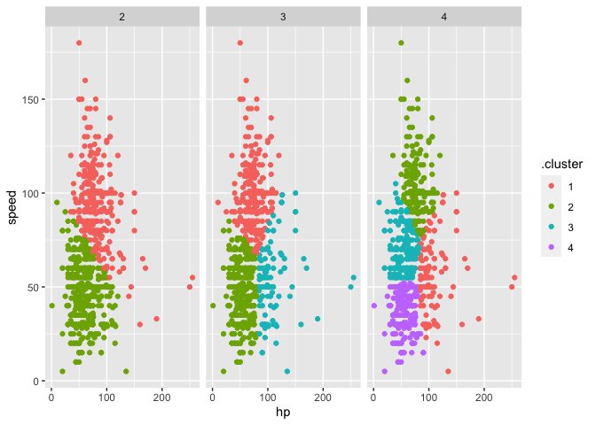

Statistical Learning
================
Daisy Yan
2022-12-01

``` r
library(tidyverse)
library(glmnet)

set.seed(1)
```

## Lasso

``` r
bwt_df = 
  read_csv("./data/birthweight.csv") %>% 
  janitor::clean_names() %>%
  mutate(
    babysex = as.factor(babysex),
    babysex = fct_recode(babysex, "male" = "1", "female" = "2"),
    frace = as.factor(frace),
    frace = fct_recode(frace, "white" = "1", "black" = "2", "asian" = "3", 
                       "puerto rican" = "4", "other" = "8"),
    malform = as.logical(malform),
    mrace = as.factor(mrace),
    mrace = fct_recode(mrace, "white" = "1", "black" = "2", "asian" = "3", 
                       "puerto rican" = "4")) %>% 
  sample_n(200)
```

Inputs for `glmnet`.

``` r
x = model.matrix(bwt ~ ., bwt_df)[,-1]
y = bwt_df$bwt
```

Fit lasso!

``` r
lambda = 10^(seq(3, -2, -0.1))

lasso_fit =
  glmnet(x, y, lambda = lambda)

lasso_cv =
  cv.glmnet(x, y, lambda = lambda)

lambda_opt = lasso_cv$lambda.min
```

``` r
broom::tidy(lasso_fit) %>% 
  select(term, lambda, estimate) %>% 
  complete(term, lambda, fill = list(estimate = 0) ) %>% 
  filter(term != "(Intercept)") %>% 
  ggplot(aes(x = log(lambda, 10), y = estimate, group = term, color = term)) + 
  geom_path() + 
  geom_vline(xintercept = log(lambda_opt, 10), color = "blue", size = 1.2) +
  theme(legend.position = "none")
```

<!-- -->

``` r
broom::tidy(lasso_cv) %>% 
  ggplot(aes(x = log(lambda, 10), y = estimate)) + 
  geom_point()  
```

<!-- -->

## Clustering

``` r
poke_df = 
  read_csv("./data/pokemon.csv") %>% 
  janitor::clean_names() %>% 
  select(hp, speed)
```

``` r
poke_df %>% 
  ggplot(aes(x = hp, y = speed)) + 
  geom_point()
```

<!-- -->

Run K means.

``` r
kmeans_fit =
  kmeans(x = poke_df, centers = 3)

poke_df =
  broom::augment(kmeans_fit, poke_df)

poke_df %>% 
  ggplot(aes(x = hp, y = speed, color = .cluster)) +
  geom_point()
```

<!-- -->

``` r
clusts =
  tibble(k = 2:4) %>%
  mutate(
    km_fit =    map(k, ~kmeans(poke_df, .x)),
    augmented = map(km_fit, ~broom::augment(.x, poke_df))
  )

clusts %>% 
  select(-km_fit) %>% 
  unnest(augmented) %>% 
  ggplot(aes(hp, speed, color = .cluster)) +
  geom_point(aes(color = .cluster)) +
  facet_grid(~k)
```

<!-- -->
